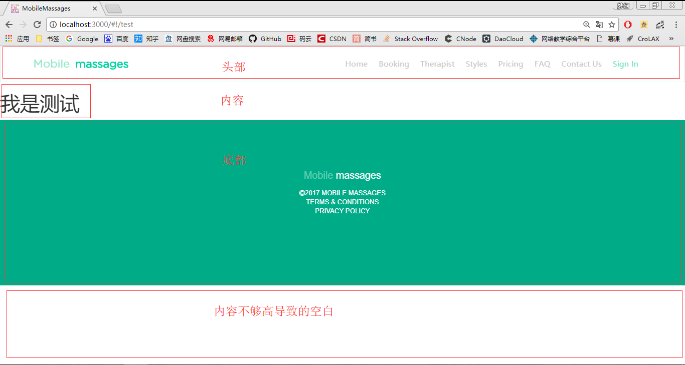

title: Mobile massages
url: https://github.com/dreamhuan/MobileMassages
transition: slide3
theme: dark
files: /css/style.css

[slide]
# Mobile massages
### 傅凯琪 徐韬 岑焕亚 吕靖之

[slide]
# 项目简介 {:&.zoomIn}
*  根据图片内容完成一个网站的前端页面和部分后端业务逻辑。
    - 前端页面PC，pad，手机横屏竖屏自适应。
    - 后端完成了简单的数据获取，登录注册，重置密码，订单提交等。

[slide]
# 项目架构&技术简介
----
* Angularjs 前端MVC框架 {:&.moveIn}
* Nodejs/Express 后端框架
* MySQL 关系型数据库
* MongoDB 文档型数据库

[slide]
# 架构图

[slide data-transition="zoomin"]
BCNF数据库设计  

[slide]
# 项目演示 {:&.bounceIn}

[slide]
# 任务分配
### 其中每个人都负责一部分的页面并做好四平台自适应
[slide data-transition="zoomin"]
* 傅凯琪
    - Booking页面step124
* 徐韬
    - Booking页面step3和登录注册
* 岑焕亚
    - 主页和主页内容一样的几个页面（contact us、FAQ、massage type）
* 吕靖之
    - 剩下页面（price、massage therapists）
[slide data-transition="zoomin"]

[slide]
# 开发过程简述
### 开发过程中基本没遇到什么大问题，这里提几个技术细节
----
[slide data-transition="zoomin"]
## 组件化
用Angularjs的路由控制模块进行视图的绑定，就可以分模块开发，  
并都塞入一个页面中，从而实现单页面应用  
举个栗子：
[slide data-transition="zoomin"]
index.html  
  
test.html  

[slide data-transition="zoomin"]

[slide data-transition="zoomin"]
## 代码模板
用Angularjs的模板语法，可以实现页面和数据的分离，并简化代码编写  
Angularjs会根据获取的数据内容动态生成html代码  
再举个栗子：
[slide data-transition="zoomin"]
faq.html  
  
faq对应的controller(js)  
  
[slide data-transition="zoomin"]
数据库的数据  
  
[slide data-transition="zoomin"]
Angularjs渲染后的结果  

[slide]
#THE END {:&.zoomIn}
